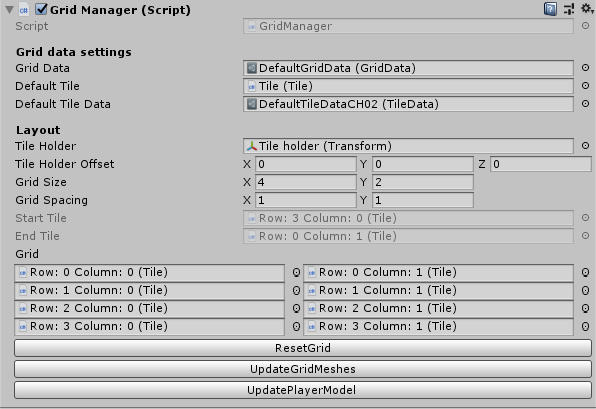
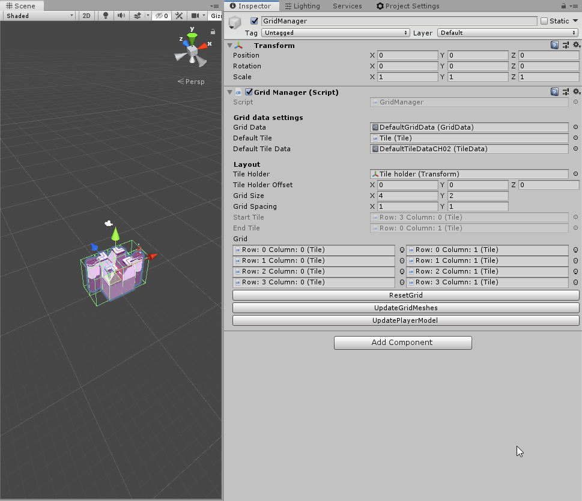
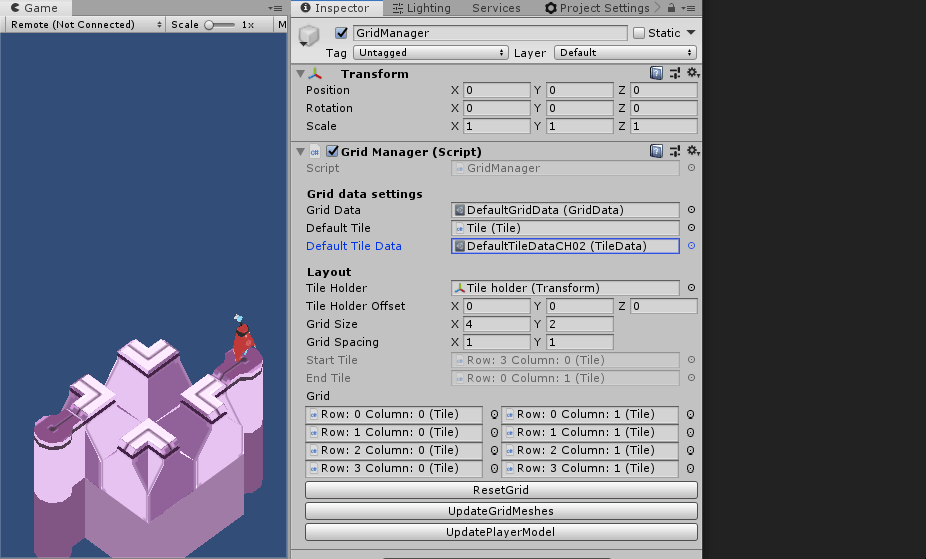
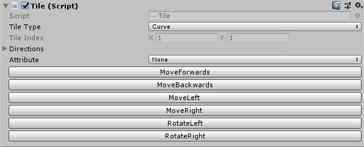
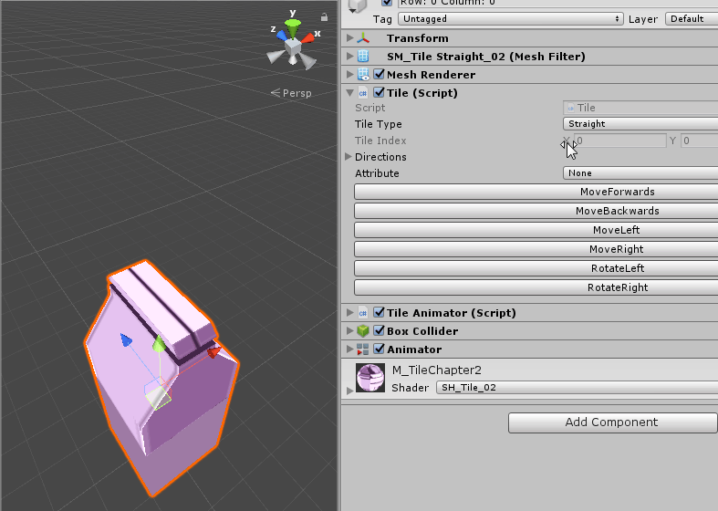
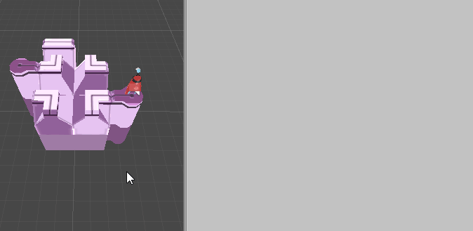

# Tools created specifically for Tiles Apart

During the development process of Tiles Apart multiple tools were created to make it easier to create levels and to automate processes.
This extends from custom Unity editor property windows, to quality of life functionality. If something could be automated or improved a tool is most likely available for you.

* [Custom Editor windows](#custom-editor-windows)
  * [The Grid Editor](#grid-editor)
  * [The Tile Editor](#tile-editor)

## Custom editor windows <a name="custom-editor-windows"/>

Multiple editor windows were created, where the biggest two would be the `Grid Editor` and the `Tile Editor`.

### The Grid Editor <a name="grid-editor"/>

The Grid Editor has a custom rendering implementation for a quick overview of the tiles available in the scene.  

You can easily resize the grid to your desired size and the Grid Editor will automatically populate or remove tiles as required.  

You can easily reskin every single tile in your scene to match the style assigned in the `Default Tile Data`  

The Grid Editor will automatically detect the start and end tiles. It'll also spawn in the player pawn whenever the start tile has been assigned.

### The Tile Editor <a name="tile-editor"/>

Clicking on a tile using the Scene View or the Hierarchy window will bring up the Tile Editor.  

The Tile Editor has a dropdown which allows you to define the type of the tile. Changing the tile will result in the tile changing its model and settings.

The Tile Editor has buttons for moving and rotating the tile across the grid.

